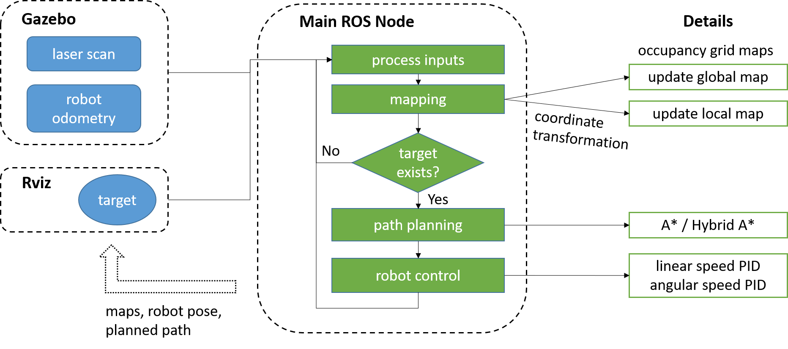
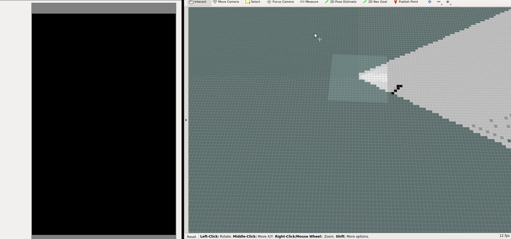

# mapBuildingWithFocusPoint

## Introduction

This project is used as a platform for coding skill practice and knowledge acquisition.

The goal of the project is to design a tool for mapping and path planning in a changing environment without a pre-map. 

The kernel idea of this project is that the navigation and decision of the robot mainly depend on the current scan-data.

### Requirements
- Develop-Environment: Ubuntu 16.04, ROS
- Software: Gazebo, Rviz
- Hardware: Turtlebot, Lidar
- Compiling: catkin_make

## Description
This Mapping and Navigation system can be roughly divided into four parts: the collection and filtering of the input data (e.g. scan data), the creation and modification of global map and local map, the path-planning with Hybrid A* algorithm and robot movement.

### Input
In this project, the lidar-data from the Simulation in Gazebo is used as input data. In Gazebo a turtle-bot with lidar is set in the middle of some obstacles. The lidar-data and the groud-truth robot-pose will be sent out by ROS. Here, the robot localization is left out because it is currently not the focus of this project; ground-truth from Gazebo will be used directly as the robot pose. 

### Process
#### Mapping
According to the received scan-data from lidar, a `global map` in the form of occupancy-grid map will be created and updated during the whole life of the program. This global map has a very low resolution (e.g. 1m or greater, with the robot size about 0.3m * 0.3m in comparison) and will be updated by the newcoming scan-data. This global map will be set in the global coordiante and stay static in the whole time. Besides, a `local map` will also be created, which has a high resolution (e.g. 1cm) and interprets only the scan-data from the current scan. The local map is in the robot's local-coordinate, which means the local map moves as the roboter moves and the roboter will always be at the origin of the local map.

#### Path-planning
Once a goal is picked in rviz, the `path-planning` method will be called for finding a suitable way leading the robot to the goal. 

The robot will firstly use the global map and the `A-star` algorithm to find a rough way from the robot current position to the final goal. With very low resolution, this calculation-process can be very fast. Every time after the map update with newcoming scan-data, the calculated way will be checked if it is blocked by obstacles: if yes, a new suitable way should be calculated with the updated global map.

With the rough way from last step, a local goal in the neighourhood of the robot in the current vision-field will be selected and used to find a suitable and more detailed route for the robot. In order to find this shorter route, the local map will be used with the A-star algorithm.(Another algorithm `Hybrid A-star` is also realized, which considers the real car-model vehicle so that it could find a more smooth route. This route allows the vehicle running forwards and backwards, making a turn and reaching the goal in a special pose. Reference: [Hybrid A-star](https://github.com/wanghuohuo0716/hybrid_A_star))

#### Motion
Motion of the robot is controlled by PID-Controllers for angular and linear speed. Parameters are set empirically as the smoothiness is not the focus of this project.

#### Communication interface
The communication among the project node, Gazebo and rviz is achieved in a source file called `communication_interface.cpp` where the subscribers and publishers are defined and functions e.g. for input processing are called. Below is an illustration of the structure. 

## Result

## To do
As next step, this system might be able to
1. incorporate simple maps (e.g. semantic map) as extra information to enhance its performance in navigation
2. add a localization part under the concept of SLAM
3. (TBD)
