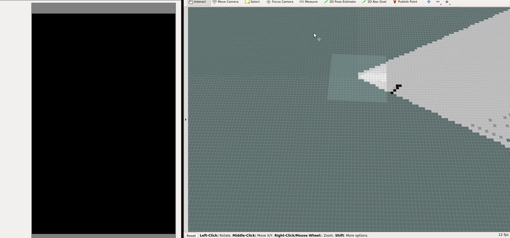

# mapBuildingWithFocusPoint

## Introduction

This project is used for private learning and practicing.

The aim of this project is to design a Lite-SLAM suitable for devices with changing map or without pre-map. This system also supports the incorporation of simple maps (e.g. semantic map) as extra information to enhance its performance in navigation.

The kernel idea of this project is that the navigation and decision of the robot is mainly depending on the current scan-data.

### Requirements
- Develop-Environment: Ubuntu 16.04, ROS
- Software: Gazebo, Rviz
- Hardware: Turtlebot, Lidar
- Compiling: catkin_make

## Description
This `Lite-SLAM` and Navigation system can be roughly divided into four parts: the collection and filtering of the input data (e.g. scan data), the creation and modification of global map and local map, and the path-planning with Hybrid A* algorithm, and robot movement.

### input
In this project the lidar-data is used as input data, which comes from the Simulation in Gazebo. In Gazebo a turtle-bot with lidar is set in the middle of some obstacles. The lidar-data and the groud-truth robot-position will be sent out by ROS.

### process
#### mapping
According to the received scan-data from lidar, a `global map` in the form of Occupancy-grid map will be created and supported during the whole life of the program. This global map has a very low resolution(e.g. 1m or greater) and will be updated by the newcoming scan-data. This global map will be set in the global coordiante and stay static in the whole time. Besides, a `local map` will also be created, which has a high resolution and interprets only the scan-data from the current scan. The local map is in the roboter's local-coordinate, which means the local map moves as the roboter moves and the roboter will always at the center of local map.

#### path-planning
Once a goal is deceided, the `path-planning` method will be called for finding a suitable way leading the roboter to the goal. The roboter will firstly use the global map and `A-star` algorithm to find a rough way from the roboter current position to the final goal. With very low resolution this calculation-process could be very fast. Every time after the updating with newcoming scan-data, the calculated way will be checked if it is blocked by obstacles, if yes, a new suitable way should be calculated with updated global map.

With the rough way from last step, a shortterm goal in the current vision-field will be selected and help finding a suitable and more detailed route for the roboter. In order to find this shortterm route the local map will be used with the A-star algorithm.(Another algorithm `Hybrid A-star` is also realized, which considers the real car-model vehicle so that it could find a more smooth route. This route allows the vehicle running forwards and backwards, making a turn and reaching the goal in a speicial pose. Reference: [Hybrid A-star](https://github.com/wanghuohuo0716/hybrid_A_star))

#### motion
The detailed motion is

## Result
